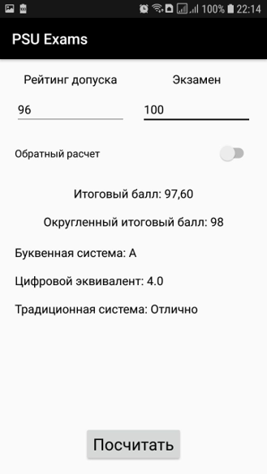
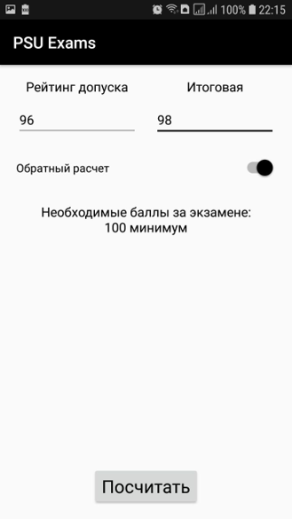

# Android ExamCalc Курсовая работа

Предмету "Разработка программ для мобильных устройств"  
ТЗ: Программа для расчета итоговой оценки по двум введенным параметрам.
- Рейтинг допуска
- Оценка за экзамен

Формула расчета: Итоговая = (РД * 0,6) + (Экзамен * 0,4)

Доп. задание: "Обратный расчет"  
Расчет необходимой на оценки которую необходимо получить на экзамене, для получения желаемой итоговой оценки.   
Формулу расчета вывести самостоятельно.  

